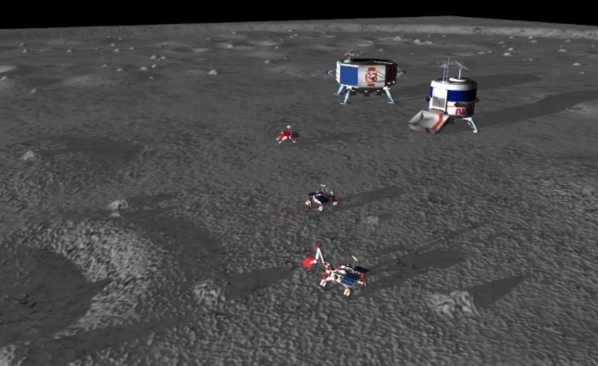
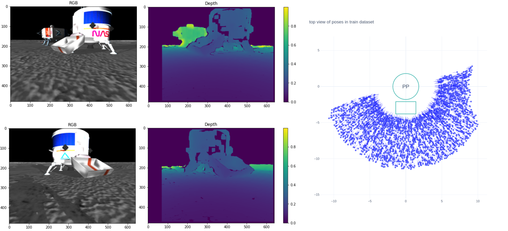
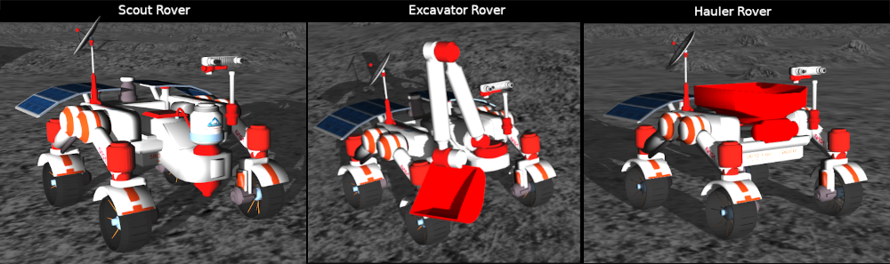
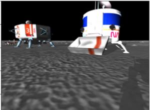

# Learned Pose Estimation

## Overview
**The goal:** using simulation data to train neural networks to estimate the pose of a rover's camera with respect to a known target object

**The mission context:**
A simulated lunar surface, with lunar landers and lunar rovers. To accomplish their ressource extraction mission, the rovers must dig, transport and deliver regolith to a processing plant. For each of these tasks, a central need is for rovers to accurately estimate the relative pose both between themselves and with the landers.



**The dataset:**
- (optional) raw rosbags with ground truth rover pose (6 DoF position and orientation) + rover camera image + stereo point cloud
- (easier) tf.data dataset ready for training (RGBD images and ground truth pose labels)
- five different scenarios for relative pose estimation, some easier, some harder!



## Quick Start
1. clone the repo and get the datasets
```
git clone https://github.com/TeamL3/learned-pose-estimation.git
cd learned-pose-estimation && mkdir data && cd data
pip install gdown
gdown --id 1vSyWPZ1f_6QqEI1tMDh14v9_nC20D9w_
unzip learned_pose_estimation_tfdatasets.zip
cd ..
```
2. build and run the docker environment
```
docker-compose build
docker-compose run --service-ports --rm lpe
```
3. ready to go!
- `jupyter notebook`
- Check the `src/architectures/quickstart` folder:
  - a notebook for data exploration `quick1_data_exploration.ipynb`
  - a notebook for example training a basic neural network with keras/tensorflow `quick2_model_training.ipynb`
- Start trying out new ideas in the `src/architectures/newIdea` folder!


## More details
The inspiration for this module was the NASA Space Robotics Challenge Phase 2 where the goal was to develop a fully autonomous team of rovers performing ressource extraction tasks on the Moon. More details [online](https://spacecenter.org/space-robotics-challenge/space-robotics-challenge-phase-2/). This repo is concerned with just a subset of the solution to this challenge developped by TeamL3 (see the TeamL3 [youtube video](https://www.youtube.com/watch?v=1304IvB1OkA) and [executive summary](https://github.com/TeamL3/learned-pose-estimation/blob/main/resources/Team%20L3%20-%20ExecutiveSummary.pdf) and the `resources` folder for more info).

Even though the challenge is over, the dataset collected can still serve as an interesting benchmark for relative pose estimation algorithms, and for other applications!

Relevant context on the environment for the relative pose estimation is given below:

Three types of rovers:
- (left) a scout rover: more simple rover, with the same body and markings as the excavator. In a mission context, this rover has a volatile sensor, used to detect resources below the lunar surface.
- (middle) an excavator rover: easily recognizable digging arm and shovel. In a mission context, this rover is used to dig up regolith/ice.
- (right) a hauler rover: easily recognizable bin. In a mission context, this rover is used to transport the excavated regolith across the lunar surface and deliver it to the processing plant.

Each rover features a stereo camera mounted on a mast, this is the sensor used to create the RGBD images in the datasets.



Two types of landers:
- (left) a repairing station: larger lander, octogonal body, with similar (confusing) body marking and color scheme. In a mission context, rovers could periodically visit this lander to re-charge and be repaired.
- (right) a processing plant: cylindrical body, with a hopper in front. In a mission context, hauler rovers would bring regolith/ice and drop their cargo in the hopper for processing / ressource extraction.

Both landers are always next to each other, with fixed position and orientation in all datasets.



The Sun direction and terrain elements (craters, rocks, slopes, ground texture) are identical in all datasets.

The simulated lunar surface is almost flat. In this dataset the relative pose estimation problem is simplified from 6 DoF (position and orientation) to just three variables: polar coordinates distance and theta + yaw orientation.

All poses are expressed in the rover's (left) camera optical frame (the transform between the rover body frame and the camera optical frame are already taken into account in the tf.data datasets labels)


Five scenarios, by increasing level of difficulty:
1. Hauler approaches the lander to offload its regolith bin into the hopper
- [video context on youtube](https://youtu.be/1304IvB1OkA?t=175) start=2min55s
- rover taking images = hauler rover
- target object for relative pose estimation = processing plant lander
- dataset name: `hopper_4500`

2. Hauler aligns with excavator in `t-formation`
- [video context on youtube](https://youtu.be/1304IvB1OkA?t=65) start=1min05s
- rover taking images = hauler rover
- target object for relative pose estimation = excavator rover
- dataset name: `t_formation_zones_3500`

3. Excavator aligns `face to face` with scout rover
- [video context on youtube](https://youtu.be/1304IvB1OkA?t=50) start=0min55s
- rover taking images = scout rover
- target object for relative pose estimation = excavator rover
- dataset name: `face_to_face_zones_2500`

4. Hauler travels to the excavator and finds the rough area on the right side of the excavator
- [video context on youtube](https://youtu.be/1304IvB1OkA?t=58) start=0min58s
- rover taking images = hauler rover
- target object for relative pose estimation = excavator rover
- dataset name: `all_around_zones_3500`

5. Excavator travels to the scout and finds the rough area in front of the scout
- [video context on youtube](https://youtu.be/1304IvB1OkA?t=47) start=0min47s
- rover taking images = excavator rover
- target object for relative pose estimation = scout rover
- dataset name: `all_around_scout_4501`


Many utilities are provided to make it easy to manipulate and visualize the dataset and model predictions / errors:
- `src/architectures/pose_utils`: Plotting + data format and reference frame conversion utilities specific to the pose estimation problem
- `src/architectures/ml_utils`: Utilities to define keras metrics, make model predictions and interface with the neptune.ai metadata logging cloud
- `src/architectures/ros_utils`: A collection of various utilities for manipulating the rosbags used for building this dataset and converting gazebo ground truth poses

Following the 'tutorial' quick start notebooks should get you familiar with the data and the utilities painlessly.


## Todo
- [x] simplified docker environment
- [ ] data download from kaggle
- [x] tensorflow data preprocessing
- [ ] (optional) explanation of rosbag datasets
- [x] data quickstart (visualize tfdata)
- [x] pose estimation : several architectures
- [x] pose estimation : training and viz tools
- [x] add docstrings to utils
- [x] readme
- [x] license
- [x] make repo public
- [ ] leaderboard / model zoo?
